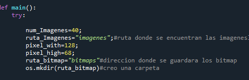

# frames_2_bytearray_pico
debes tener una carpeta que contenga las imagenes con extencion .png para poder convertirlas a un archivo .txt con el bytearray para poder cargarlas a la raspberry pi pico

en la variable ruta_imagenes  hace referencia a la ruta donde se encuentran las imagenes la variable ruta_bitmap hace referencia a la ruta donde se guardaran los archivos txt ,
num_imagenes es el total de imagenes que  que se convertiran a bytearray, pixel_with y pixel_heigh hace referencia al tamaño de las imagenes 
